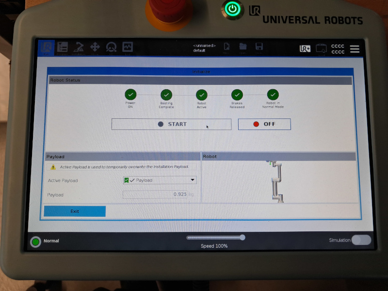

# Set the Ur5 robot teach pendant in ROS2 mode

**Switch on the robot**

When you `switch on the robot (green button)`, the display is as follows

**Activate the robot**

Then by `clicking on the red button at bottom left`, the display is as follows

By `clicking on the On button then Start button`, the display is as follows

You hear the brakes release and can now move the robot with the teach pendant. The bottom left button changes from red to green.
`Exit this window by clicking on exit`.
The next steps are to launch a program to enable connection with the remote PC running ros2.

`Exit this window by clicking on exit`.

**Activate the gripper**

The home windows is displayed

`Click on the button at top right UR+` to open the gripper window as displayed below.

`Click on button Activate gripper`, then gripper will be closed and opened and a new window appears.

Now, You can `exit of this gripper window`.

**Run a program**

The next steps are to launch a program to enable connection with the remote PC running ros2.
The home windows is displayed

`click to the main button Run a Program`

**Load ros2 program**

All available programs are displayed

`Select the ros.urp program and click on Open button`

**Run ros2 program**

When the ros2 program is loaded, run it by `clicking on the control button play`

**Ros2 connection launched**

The robot connection is now established with ros2, you  see a table with the variables exchanged with the ros2 driver.
